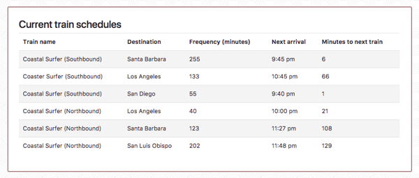
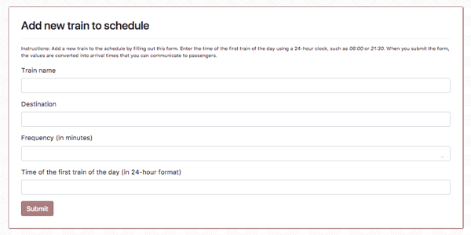

# Build transit schedules with JavaScript and Firebase

This app demonstrates using a [Firebase Realtime Database](https://firebase.google.com/docs/database/) to store transit schedule data, which is used to calculate timetables and arrival times for the fictional Coaster Surfer commuter rail system.

The app has a dashboard of current trains and upcoming arrival times, and a form to add a new train to the schedule.

To add new train to the schedule, an administrator needs to provide the name of the train, the destination, its frequency, and the time of the first train of the day.

Because transit data is often written with a 24-hour clock, such as 06:00 or 21:30, the administrator enters the information using that format. Upon submitting the form, the train is added to the schedule list and the time values are converted into upcoming arrivals that could be communicated to passengers.

_Note: These schedules are for demonstration purposes only and do not reflect actual routes. In addition, the calculations assume evenly distributed train frequencies throughout the day._

## Technology

This project was built with JavaScript, jQuery, Bootstrap, HTML, and CSS. The data is in a Firebase Realtime Database.
